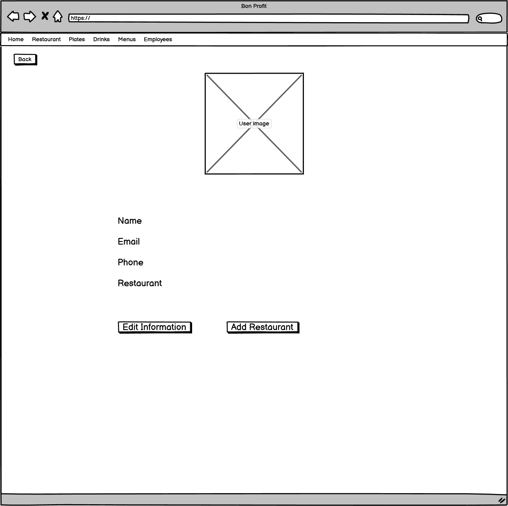

# Description of the project
For the final project, I created an application to manage restaurant menus and employees.

There are three types of users: restaurant owners, users and anonymous.

The restaurant owner can create restaurants with all the information that the customers need, plates and drinks grouped by categories and employees. This way the owner can customize the menu with new plates and drinks, and it will always be up to date. It is also possible to update the information of the restaurant, plates, drinks and employees and delete them if the owner wants. The restaurant list the owners can see, will only show their restaurants so it is easier to manage them.

The user can see a list of all the restaurants in the application and to find the restaurant faster, a search bar is available. They can also see the menus of each of them with images and click on the plates and drinks if they want more information, like the ingredients and price. Only the users can rate the restaurant, so they que give feedback to the owner.

And the anonymous can see everything the user can, but they can't rate the restaurant. These type of users do not have an account in the application.

With this application customers will have all the menus in one location and they will not have look for it on the internet, scan a qr or have an application for every restaurant. And the can also see photos os everything and all the informations they need.

# Wireframes
|    |            |
|-------------------------------------------------|-----------------------------------------------------|
| Home page                                       | User details                                        |
|  |  |
| Restaurant                                      | Restaurant details                                  |
|   |        |
| Employees                                       | Employee details                                    |
|      |            |
| Drink category list                             | Drinks list                                         |
|       |          |
| Drink details                                   | Plate category list                                 |
|       |           |
| Plates list                                     | Plate details                                       |

# Technologies Used
**React**

React is an open source JavaScript library that helps create user interfaces on a single page.

**React Router**

React Router is the standard routing library for React.

**Axios**

Axios is a promise-based HTTP Client for node.js and the browser.

**Ant Design**

Ant Design is a React UI library that has a lot of easy-to-use components that are useful for creating user interfaces.

# Components and Pages
**Pages**
- Error page
- Home page
- User details
- Login
- Singup
- Restaurant pages
  - Restaurant details
  - Restaurant list
  - Restaurant owner list
- Drink pages
  -  Drink category list
  - Drink details
  - Drink list
- Employee pages
  - Employee details
  - Employee list
- Plate pages
  - Plate category list
  - Plate details
  - Plate list

# Demo

## Future work
For future work I would like to create menus, like night menus, weekend menus, this way the owners would add plates and drinks and put a price for the menu.
Add comments, so the users can add more feedback and the owners will know what they think about their restaurants.

Also work on the design for the user experience and make it responsive, for mobiles and tablets and try to put the dark mode.

## Resources
Link to the [Trello](https://trello.com/invite/b/dY098zTk/8f889a099ca009a7e1f5582c379e9d72/final-project) board.
[Ant Design](https://ant.design/components/overview/)

Thank you Raymond and Shaun for all the help during this project.
